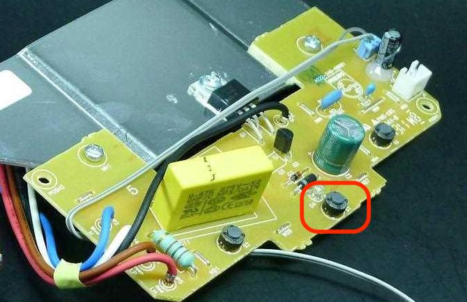
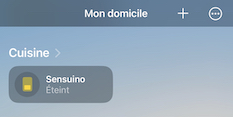

# Sensuino
_How I hacked a Senseo coffee maker to heat it up remotely._

## Use case 
I am the happy owner of a Senseo coffee maker. The least we can say is that it serves me well as I usually drink at least three cups a day. The only problem I have been having with it is the heating time.

When I come in the kitchen to make myself a coffee, I press the On/Off button and the machine starts heating up the water while I take out a pod of coffee and put it inside, I often end up waiting for a minute or so that the heating ends so I can press the "Run" button.

I though it could be nice if I could start the heating remotely (from my bed or my desk for example), so when I arrive in the kitchen, the machine is ready and I don't have to wait a second before getting my cup filled. 

## Solution
I decided not to do anything about the run buttons that actually pour the coffee because I would always need to put the pod in the machine and a cup on the tray before running it anyway. The only thing I need is a way to remotely push the On/Off button.

## Hardware hack
I will not expand here on the opening of the machine. iFixit and YouTube have good tutorials on this part (which is not that long or difficult anyway). 

Once opened, I soldered a couple of wires to the contacts of the On/Off switch. I used Dupont wires to facilitate the connection later on.



I let the wires exit the machine through an opening already made on the support base.


This wires being connected on each port of the On/Off button, connecting them together has the exact same effect as pushing the button. If the machine is off, it turns it on and start heating the water. If the machine is on, it turns it off.

## Circuit

To connect the coffee maker, I went for a Wemos D1 mini (as this was the only WiFi board I had available at this time). The concept is quite easy as I just have to contact the two wires to make it work. 

I went for an optocoupler 4N35. Its input is connected to a pin of the Wemos. When this output is set to HIGH, the internal LED of the 4N35 lights up and its outputs are coupled. Both wires coming from the coffee maker are connected to these outputs.

Therefore when the PIN of the Wemos is set to HIGH, for the Senseo, it is like someone is pressing the button. 

## Software

The software is contained in this repository.

It is based on [my template for ESP8266 with web server](http://www.github.com/fmanach/esp8266-template-webserver).

__One would have to install the ESP8266 Arduino core before being able to compile it.__

Basically, the Wemos board connect to WiFi and start a web server waiting for a request on the /pushButton endpoint. When this request is made, the PIN connected to the optocoupleur is set to HIGH for 500ms and back to LOW. That way, it simulates a push on the On/Off button.

The Wemos announces itself through mDNS in order to be reachable without having to find its IP address. 

Once started, any call on http://sensuino.local/pushButton from the local network would start the heating.

## Home automation

The main reason why I chose to expose an HTTP endpoint was because I wanted the remote heating to be integrated in home automation platforms. 

As a user of Apple devices, my platform of choice is HomeKit and I have a [Hombridge](https://github.com/homebridge) instance running for all that is not HomeKit compatible. 

Thanks to the [homebridge-http-switch](https://github.com/Supereg/homebridge-http-switch) plugin, I have been able to integrate my coffee maker in my HomeKit environnement. I used a stateless switch so Homebridge take care of switching back to Off two seconds after I turned it on.

Here is the config I used in Homebridge :
```
"accessories": [
        {
            "accessory": "HTTP-SWITCH",
            "name": "Sensuino",
            "switchType": "stateless",
            "timeout": 2000,
            "onUrl": "http://sensuino.local/pushButton"
        }
    ],
```
Now, I can start the heating of my Sensuino from the iOS Home App or vocally with Siri. I also added it to my "Good morning !" scene that I trigger when I wake up.

